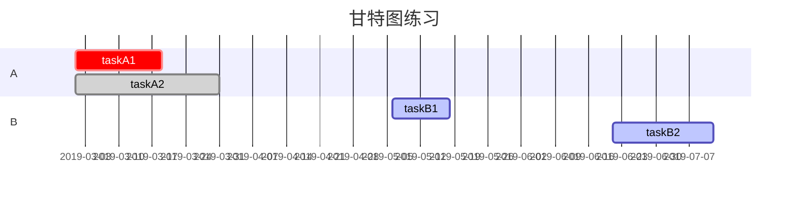

作为未来的一名极客，写博客是日常操作，而markdown作为一种轻量级的笔记语言，当然是我的首选。

<!--more-->


## 工具
[菜鸟工具--markdown编辑器](https://c.runoob.com/front-end/712)  
[有道云笔记--网页版](https://note.youdao.com/web)

## 语法（本人不熟悉的）

* ### 表格
#### markdown表格 

```markdown
|表头1|表头2|表头3|
|:-|:-:|-:|
|左对齐|居中对齐|右对齐|
```
| 表头1      |      表头2      |             表头3 |
| :--------- | :-------------: | ----------------: |
| 左对齐     |    居中对齐     |            右对齐 |
| dfsfsafasf | dsfsfasdfadsdfa | fdasfdsafasfasfsa |

---
#### html表格  

<table>
    <tr>
        <th>表头一</th>
        <th>表头二</th>
        <th>表头三</th>
    </tr>
    <tr>
        <td>表头一</td>
        <td>表头二</td>
        <td>表头三</td>
    </tr>
</table>  

上代码：
```html
<table>
    <tr>
        <th>表头一</th>
        <th>表头二</th>
        <th>表头三</th>
    </tr>
    <tr>
        <td>表头一</td>
        <td>表头二</td>
        <td>表头三</td>
    </tr>
</table>
```

----

* ### 图表  
#### 流程图  


说明：
* graph关键字 标示流程图方向   

| 标示符 |     含义      |
| :----: | :-----------: |
|   T    |  "top" 上面   |
|   B    | "bottom" 下面 |
|   L    |  "left" 左边  |
|   R    | "right" 右边  |
则 TB 即 Top to Bottom==：从上至下


* 节点形状
大写字母表示节点，name表示节点的名字，主要形状如下：

| 节点类型 |   符号   |
| :------: | :------: |
|   矩形   |  [name]  |
|   菱形   |  {name}  |
|   圆角   |  (name)  |
|   圆形   | ((name)) |
|   标签   |  >name]  |

* 连线  

>箭头连接 A1–>B1

>开放连接 A2—B2

>标签连接 A3-- text —B3 或者 A3—|text|B3

>箭头标签连接 A4–text–>B4 或者 A4–>|text|B4

>虚线开放连接 A5.-B5 或者 A5-.-B5 或者 A5…-B5

>虚线箭头连接 A6.->B6 或者 A6-.->B6

>标签虚线连接 A7-.text.-B7

>标签虚线箭头连接 A8-.text.->B8

>粗线开放连接 A9===B9

>粗线箭头连接 A10==>B10

>标签粗线开放连接 A11==text===B11

>标签粗线箭头连接A12==text==>B12

* 基础fontawesome支持  
暂不讨论

---

#### gantt



gantt图结构：  
1. ==dateFormat==: 指定日期格式
2. ==title==: 指定标题
3. ==section==: 项目
4. ==task-name==: 任务名，后跟三项参数[^1]     

第一项：任务标识  


|  标识   |    含义    |
| :----: | :--------: |
|  done  |    已做    |
|  crit  |    重点    |
| active |  正在进行  |
|  (无)   | 默认待完成 |

第二项：日期
1. 绝对日期：具体的年月日
2. 相对日期：使用语法 "after" 接任务名

第三项：持续时间
n(y,m,d,h)

- [x] 待办
- [ ] jnn


###  数学公式LaTex

## **1. 样式系列**

### **1.1. 换行`\\`、空格`\:`**

```
$换行\\萌萌哒\:小明$
```


### **1.2. 居中`$$\**$$`**

```
$$萌萌哒$$
```


### **1.3. 加粗（mathbf）、斜体（mathit）**

```
$\mathbf{萌萌哒}$

$\mathit{小明}$
```


### **1.4. 大小**

```
$\tiny 萌萌哒$

$\scriptsize 萌萌哒$

$\small 萌萌哒$

$\normalsize 萌萌哒(正常)$

$\large 萌萌哒$

$\Large 萌萌哒$

$\huge 萌萌哒$

$\Huge 萌萌哒$
```


如果是单行写，记得加换行符号：

```
$\tiny 萌萌哒\\$
$\scriptsize 萌萌哒\\$
$\small 萌萌哒\\$
$\normalsize 萌萌哒(正常)\\$
$\large 萌萌哒\\$
$\Large 萌萌哒\\$
$\huge 萌萌哒\\$
$\Huge 萌萌哒\\$
```

### **1.5. 颜色（有些编辑器不支持）**

```
$\color{Red}{Red}$, $\color{blue}{Blue}$,  $\color{orange}{Orange}$,  
$\color{Green}{Green}$,  $\color{gray}{Gray}$,  $\color{purple}{Purple}$.
```


, ,


,
,


, .

## **2. 常用数学**

### **2.1. 常用表达式**

**常用数学 LaTex 公式**


```
$\sqrt{ab}$
```


```
$\sqrt[n]{ab}$
```


```
$\log_{a}{b}$
```


```
$\lg{ab}$
```


```
$a^{b}$
```


```
$a_{b}$
```


```
$x_a^b$
```


```
$\int$
```


```
$\int_{a}^{b}$
```


```
$\oint$
```


```
$\oint_a^b$
```


```
$\sum$
```


```
$\sum_a^b$
```


```
$\coprod$
```


```
$\coprod_a^b$
```


```
$\prod$
```


```
$\prod_a^b$
```


```
$\bigcap$
```


```
$\bigcap_a^b$
```


```
$\bigcup$
```


```
$\bigcup_a^b$
```


```
$\bigsqcup$
```


```
$\bigsqcup_a^b$
```


```
$\bigvee$
```


```
$\bigvee_a^b$
```


```
$\bigwedge$
```


```
$\bigwedge_a^b$
```


```
$\widetilde{ab}$
```


```
$\widehat{ab}$
```


```
$\overleftarrow{ab}$
```


```
$\overrightarrow{ab}$
```


```
$\overbrace{ab}$
```


```
$\underbrace{ab}$
```


```
$\underline{ab}$
```


```
$\overline{ab}$
```


```
$\frac{ab}{cd}$
```


```
$\frac{\partial a}{\partial b}$
```


```
$\frac{\text{d}x}{\text{d}y}$
```


```
$\lim_{a \rightarrow b}$
```


### **2.2. 附录：数学公式大全**

**数学公式 LaTex 公式**


```
$\displaystyle\sum\limits_{i=0}^n i^3$
```


```
$\left(\begin{array}{c}a\\ b\end{array}\right)$
```


```
$\left(\frac{a^2}{b^3}\right)$
```


```
$\left.\frac{a^3}{3}\right\lvert_0^1$
```


```
$\begin{bmatrix}a & b \\c & d \end{bmatrix}$
```


```
$\begin{cases}a & x = 0\\b & x > 0\end{cases}$
```


```
$\sqrt{\frac{n}{n-1} S}$
```


```
$\begin{pmatrix} \alpha& \beta^{*}\\ \gamma^{*}& \delta \end{pmatrix}$
```


```
$A\:\xleftarrow{n+\mu-1}\:B$
```


```
$B\:\xrightarrow[T]{n\pm i-1}\:C$
```


```
$\frac{1}{k}\log_2 c(f)\;$
```


```
$\iint\limits_A f(x,y)\;$
```


```
$x^n + y^n = z^n$
```


```
$E=mc^2$
```


```
$e^{\pi i} - 1 = 0$
```


```
$p(x) = 3x^6$
```


```
$3x + y = 12$
```


```
$\int_0^\infty \mathrm{e}^{-x}\,\mathrm{d}x$
```


```
$\sqrt[n]{1+x+x^2+\ldots}$
```


```
$\binom{x}{y} = \frac{x!}{y!(x-y)!}$
```


```
$\frac{\frac{1}{x}+\frac{1}{y}}{y-z}$
```


```
$f(x)=\frac{P(x)}{Q(x)}$
```


```
$\frac{1+\frac{a}{b}}{1+\frac{1}{1+\frac{1}{a}}}$
```


```
$\sum_{\substack{0\le i\le m\\ 0\lt j\lt n}} P(i,j)$
```


```
$\lim_{x \to \infty} \exp(-x) = 0$
```


```
$\cos (2\theta) = \cos^2 \theta - \sin^2 \theta$
```


## **3. 数学符号**

### **3.1. 集合系列**

**运算符公式运算符公式运算符公式**


```
$\emptyset$
```


```
$\in$
```


```
$\notin$
```


```
$\subset$
```


```
$\supset$
```


```
$\subseteq$
```


```
$\nsubseteq$
```


```
$\nsupseteq$
```


```
$\nsubseteqq$
```


```
$\nsupseteqq$
```


```
$\subsetneq$
```


```
$\supsetneq$
```


```
$\subsetneqq$
```


```
$\supsetneqq$
```


```
$\varsubsetneq$
```


```
$\varsupsetneq$
```


```
$\varsubsetneqq$
```


```
$\varsupsetneqq$
```


```
$\bigcap$
```


```
$\bigcup$
```


```
$\bigvee$
```


```
$\bigwedge$
```


```
$\biguplus$
```


```
$\bigsqcup$
```


```
$\Subset$
```


```
$\Supset$
```


```
$\subseteqq$
```


```
$\supseteqq$
```


```
$\sqsubset$
```


```
$\sqsupset$
```


### **3.2. 常用符号**

**基本符号公式基本符号公式基本符号公式**


```
$\cdot$
```


```
$\vdots$
```


```
$\grave{x}$
```


```
$.$
```


```
$\ddots$
```


```
$\breve{x}$
```


```
$*$
```


```
$,$
```


```
$\dot{x}$
```


```
$+$
```


```
$!$
```


```
$\widehat{xxx}$
```


```
$-$
```


```
$;$
```


```
$\ddot{x}$
```


```
$\times$
```


```
$?$
```


```
$\check{x}$
```


```
$\div$
```


```
$\colon$
```


```
$\ddot{x}$
```


```
$=$
```


```
$\acute{x}$
```


```
$\tilde{x}$
```


```
$\neq$
```


```
$\bar{x}$
```


```
$\hat{x}$
```


```
$\dotsm$
```


```
$\vec{x}$
```


```
$\dddot{x}$
```


```
$\dotso$
```


```
$\widetilde{xxx}$
```


```
$\backslash$
```


```
$/$
```


```
$\bracevert$
```


```
$]$
```


```
$\smallsetminus$
```


```
$\lVert$
```


```
$\lbrace$
```


```
$\arrowvert$
```


```
$\rVert$
```


```
$\rbrace$
```


```
$\lgroup$
```


```
$\langle$
```


```
$\lvert$
```


```
$\rgroup$
```


```
$\rangle$
```


```
$\rvert$
```


```
$[$
```


```
$\lmoustache$
```


```
$\rmoustache$
```


```
$\lceil$
```


```
$\rceil$
```


```
$\lfloor$
```


```
$\rfloor$
```


### **3.3. 希腊字母表**

**字母公式字母公式字母公式**


```
$\alpha$
```


```
$\beta$
```


```
$\chi$
```


```
$\delta$
```


```
$\Delta$
```


```
$\epsilon$
```


```
$\eta$
```


```
$\Gamma$
```


```
$\iota$
```


```
$\kappa$
```


```
$\lambda$
```


```
$\Lambda$
```


```
$\mu$
```


```
$\nabla$
```


```
$\nu$
```


```
$\omega$
```


```
$\Omega$
```


```
$\phi$
```


```
$\Phi$
```


```
$\pi$
```


```
$\Pi$
```


```
$\psi$
```


```
$\Psi$
```


```
$\rho$
```


```
$\sigma$
```


```
$\Sigma$
```


```
$\tau$
```


```
$\theta$
```


```
$\Theta$
```


```
$\upsilon$
```


```
$\varepsilon$
```


```
$\varsigma$
```


```
$\vartheta$
```


```
$\xi$
```


```
$\zeta$
```


### **3.4. 函数公式表**

**函数公式函数公式函数公式**


```
$\sin$
```


```
$\sin^{-1}$
```


```
$\inf$
```


```
$\cos$
```


```
$\cos^{-1}$
```


```
$\arg$
```


```
$\tan$
```


```
$\tan^{-1}$
```


```
$\det$
```


```
$\sinh$
```


```
$\sinh^{-1}$
```


```
$\dim$
```


```
$\cosh$
```


```
$\cosh^{-1}$
```


```
$\gcd$
```


```
$\tanh$
```


```
$\tanh^{-1}$
```


```
$\hom$
```


```
$\csc$
```


```
$\exp$
```


```
$\ker$
```


```
$\sec$
```


```
$\lg$
```


```
$\Pr$
```


```
$\cot$
```


```
$\ln$
```


```
$\sup$
```


```
$\coth$
```


```
$\log$
```


```
$\deg$
```


```
$\hom$
```


```
$\log_{e}$
```


```
$\injlim$
```


```
$\arcsin$
```


```
$\log_{10}$
```


```
$\varinjlim$
```


```
$\arccos$
```


```
$\lim$
```


```
$\varprojlim$
```


```
$\det$
```


```
$\liminf$
```


```
$\varliminf$
```


```
$\arctan$
```


```
$\limsup$
```


```
$\projlim$
```


```
$\textrm{arccsc}$
```


```
$\max$
```


```
$\varlimsup$
```


```
$\textrm{arcsec}$
```


```
$\min$
```


```
$\textrm{arccot}$
```


```
$\infty$
```


### **3.5. 特殊符号 - 箭头系列**

**箭头公式箭头公式箭头公式**


```
$\uparrow$
```


```
$\longleftarrow$
```


```
$\downdownarrows$
```


```
$\downarrow$
```


```
$\longrightarrow$
```


```
$\upuparrows$
```


```
$\updownarrow$
```


```
$\rightarrow$
```


```
$\rightharpoondown$
```


```
$\Uparrow$
```


```
$\leftarrow$
```


```
$\downharpoonleft$
```


```
$\Downarrow$
```


```
$\mapsto$
```


```
$\rightharpoonup$
```


```
$\Leftarrow$
```


```
$\nrightarrow$
```


```
$\downharpoonright$
```


```
$\Rightarrow$
```


```
$\nleftarrow$
```


```
$\upharpoonleft$
```


```
$\Leftrightarrow$
```


```
$\rightrightarrows$
```


```
$\upharpoonright$
```


```
$\nLeftrightarrow$
```


```
$\leftleftarrows$
```


```
$\leftharpoondown$
```


```
$\nLeftarrow$
```


```
$\rightleftarrows$
```


```
$\leftharpoonup$
```


```
$\nRightarrow$
```


```
$\leftrightarrows$
```


```
$\hookleftarrow$
```


```
$\Updownarrow$
```


```
$\curvearrowleft$
```


```
$\hookrightarrow$
```


```
$\circlearrowleft$
```


```
$\curvearrowright$
```


```
$\rightleftharpoons$
```


```
$\circlearrowright$
```


```
$\Longleftarrow$
```


```
$\leftrightharpoons$
```


```
$\Lleftarrow$
```


```
$\Longrightarrow$
```


```
$\looparrowleft$
```


```
$\Rrightarrow$
```


```
$\longleftrightarrow$
```


```
$\looparrowright$
```


```
$\nwarrow$
```


```
$\Longleftrightarrow$
```


```
$\rightsquigarrow$
```


```
$\swarrow$
```


```
$\longmapsto$
```


```
$\Lsh$
```


```
$\searrow$
```


```
$\rightarrowtail$
```


```
$\Rsh$
```


```
$\nearrow$
```


```
$\leftarrowtail$
```


```
$\multimap$
```


```
$\twoheadleftarrow$
```


```
$\twoheadrightarrow$
```


```
$\leftrightsquigarrow$
```


```
$\leftrightarrow$
```


```
$\nleftrightarrow$
```


## **4. 逆天常用**

逆天用到就添加进去（不定期更新）根据上面有的，这些其实都可以自己写出来的

### **4.1. 二次方程求解**

```
$\mathbf{a*x^2+b*x+c}$

$$x={\frac{-b \pm \sqrt{b^2-4ac}}{2a}}$$ or $$x = {-b \pm \sqrt{b^2-4ac} \over 2a}$$
```


### **4.2. 矩阵系列**

```
$$
\begin{bmatrix}
1&0&0 \\
0&1&0 \\
0&0&1
\end{bmatrix}
$$
```


### **4.3 方程组**

### **左侧花括号**

```
​```
\begin{equation}
% \begin{equation*} 加'*'去掉公式编号
\left\{
\begin{aligned}     %请使用'aligned'或'align*'
2x + y  &= 1  \\     %加'&'指定对齐位置
2x + 2y &= 2
\end{aligned}
\right.
\end{equation}
% \end{equation*}   加'*'去掉公式编号

% 注意：在 markdown 环境下，某些特殊字符，如'\', '*'等，会首先被 markdown 语法转义，然后再被 Latex 转义。
% 因此有时候 '\{'需要写作'\\{'，'*'需要写作'\*'，'\\'需要写作'\\\\'等，视不同的解释环境而定
​```
```


**注**：如果各个方程需要在某个字符处对齐（如等号对齐），只需在所有要对齐的字符前加上 `&` 符号。如果不需要公式编号，只需在宏包名称后加上 `*` 号。

### **分情况讨论方程式**

```
​```
f(x) =
\begin{cases}
x^2 \qquad & a \gt 0 \\
e^x \qquad & a \le 0
\end{cases}
​```
```


### **4.4 编号**

### **插入编号**

使用 `\tag` 指令指定公式的具体编号，并使用 `\label` 指令埋下锚点。如 `y=x^2 \tag{1.5a} \label{eq:test}`：


### **引用编号**

使用 `\eqref` 指令引用前面埋下的锚点，`\eqref{eq:test}` 将显示为：


。(简书里还不支持公式编号的锚点引用)。

-----------未完待续！