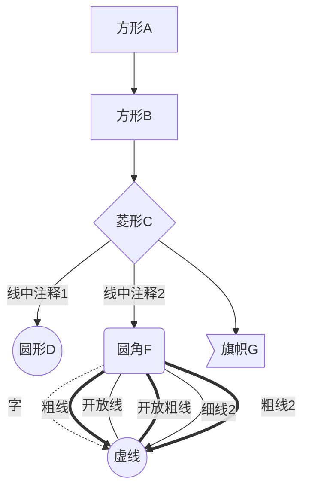
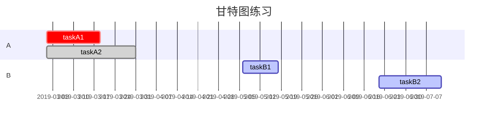

作为未来的一名极客，写博客是日常操作，而markdown作为一种轻量级的笔记语言，当然是我的首选。

<!--more-->


## 工具
[菜鸟工具--markdown编辑器](https://c.runoob.com/front-end/712)  
[有道云笔记--网页版](https://note.youdao.com/web)

## 语法（本人不熟悉的）

* ### 表格
#### markdown表格 

```markdown
|表头1|表头2|表头3|
|:-|:-:|-:|
|左对齐|居中对齐|右对齐|
```
| 表头1      |      表头2      |             表头3 |
| :--------- | :-------------: | ----------------: |
| 左对齐     |    居中对齐     |            右对齐 |
| dfsfsafasf | dsfsfasdfadsdfa | fdasfdsafasfasfsa |

---
#### html表格  

<table>
    <tr>
        <th>表头一</th>
        <th>表头二</th>
        <th>表头三</th>
    </tr>
    <tr>
        <td>表头一</td>
        <td>表头二</td>
        <td>表头三</td>
    </tr>
</table>  

上代码：
```html
<table>
    <tr>
        <th>表头一</th>
        <th>表头二</th>
        <th>表头三</th>
    </tr>
    <tr>
        <td>表头一</td>
        <td>表头二</td>
        <td>表头三</td>
    </tr>
</table>
```

----

* ### 图表  
#### 流程图  


说明：
* graph关键字 标示流程图方向   

| 标示符 |     含义      |
| :----: | :-----------: |
|   T    |  "top" 上面   |
|   B    | "bottom" 下面 |
|   L    |  "left" 左边  |
|   R    | "right" 右边  |
则 TB 即 Top to Bottom==：从上至下


* 节点形状
大写字母表示节点，name表示节点的名字，主要形状如下：

| 节点类型 |   符号   |
| :------: | :------: |
|   矩形   |  [name]  |
|   菱形   |  {name}  |
|   圆角   |  (name)  |
|   圆形   | ((name)) |
|   标签   |  >name]  |

* 连线  

>箭头连接 A1–>B1

>开放连接 A2—B2

>标签连接 A3-- text —B3 或者 A3—|text|B3

>箭头标签连接 A4–text–>B4 或者 A4–>|text|B4

>虚线开放连接 A5.-B5 或者 A5-.-B5 或者 A5…-B5

>虚线箭头连接 A6.->B6 或者 A6-.->B6

>标签虚线连接 A7-.text.-B7

>标签虚线箭头连接 A8-.text.->B8

>粗线开放连接 A9===B9

>粗线箭头连接 A10==>B10

>标签粗线开放连接 A11==text===B11

>标签粗线箭头连接A12==text==>B12

* 基础fontawesome支持  
暂不讨论

---

#### gantt



gantt图结构：  
1. ==dateFormat==: 指定日期格式
2. ==title==: 指定标题
3. ==section==: 项目
4. ==task-name==: 任务名，后跟三项参数[^1]     

第一项：任务标识  


|  标识   |    含义    |
| :----: | :--------: |
|  done  |    已做    |
|  crit  |    重点    |
| active |  正在进行  |
|  (无)   | 默认待完成 |

第二项：日期
1. 绝对日期：具体的年月日
2. 相对日期：使用语法 "after" 接任务名

第三项：持续时间
n(y,m,d,h)

- [x] 待办
- [ ] jnn


-----------未完待续！